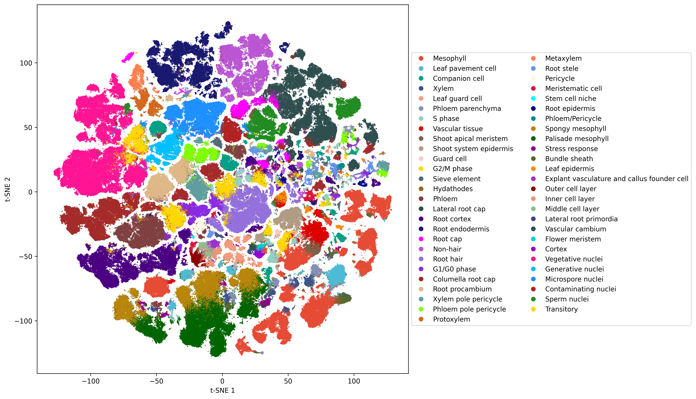
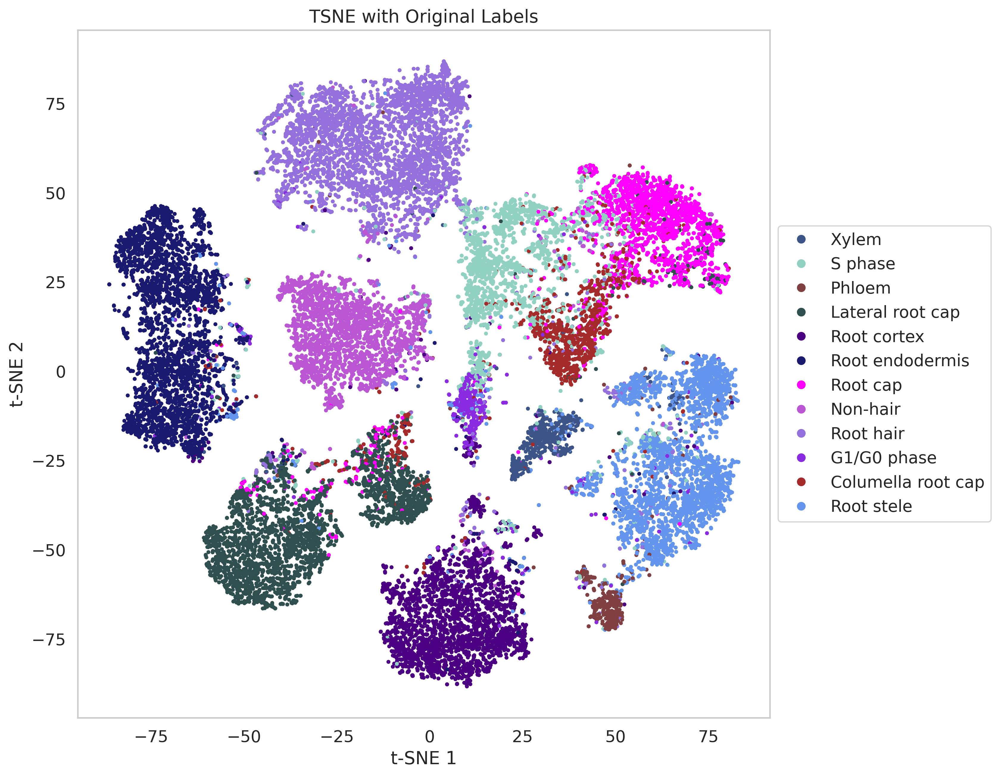
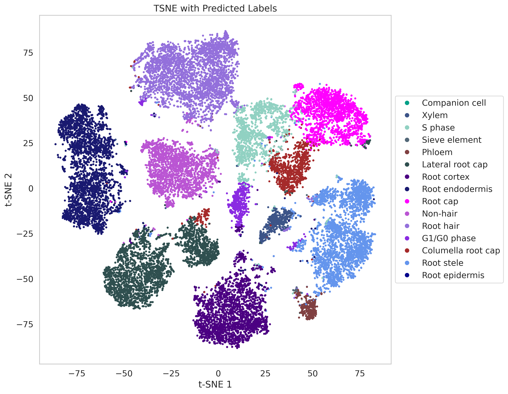
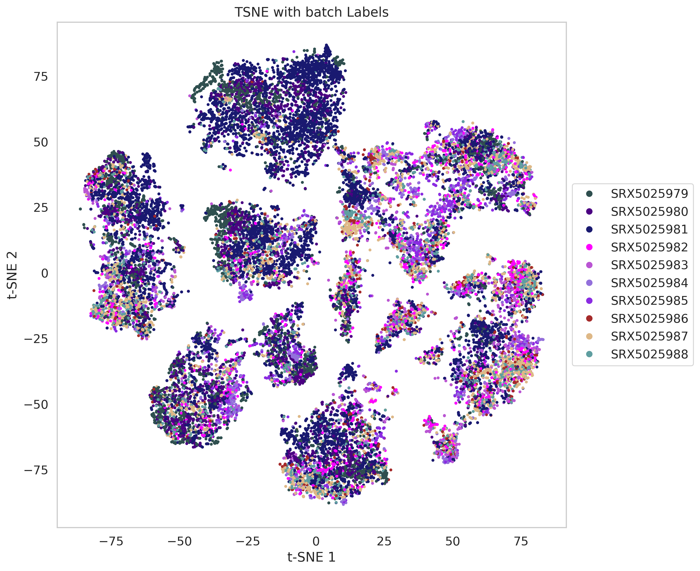

<!--
 * @Author: cgshuo cgshuo@163.com
 * @Date: 2024-05-29 13:47:31
 * @LastEditors: cgshuo cgshuo@163.com
 * @LastEditTime: 2024-05-29 14:07:49
 * @FilePath: \undefinedd:\OneDrive\code\NJU\scPlantGPT\README.md
 * @Description: 这是默认设置,请设置`customMade`, 打开koroFileHeader查看配置 进行设置: https://github.com/OBKoro1/koro1FileHeader/wiki/%E9%85%8D%E7%BD%AE
-->
# scPlantGPT

# Single-Cell Plant Generative Pre-trained model

This project aims to pretrain a large model using 1 million plant single-cell data and further pretrain a cell annotation model and a batch integration model based on this pretrained model. Ultimately, we can use these pretrained models for cell annotation, providing an efficient method for handling large-scale plant single-cell data.

## Project Overview

1. **Data Preparation**: Use 1 million plant single-cell data for training.
2. **Pretraining the Generative Model**: Pretrain a generative model.
3. **Pretraining the Cell Annotation Model**: Use the pretrained generative model's weights to further pretrain the cell annotation model on the 1 million plant single-cell data.
4. **Pretraining the Batch Integration Model**: Use the pretrained generative model's weights to further pretrain the batch integration model on the 1 million plant single-cell data.
5. **Cell Annotation Application**: Use the pretrained cell annotation model for cell annotation. You can choose to apply it directly or fine-tune it before application.

## Article in Progress

An article detailing the methodology and results of this project is currently being drafted and will be published soon. Stay tuned for more information.

## Example Results

Here are some example results generated by the scPlantGPT model:










## Table of Contents

- [Installation](#installation)
- [Usage](#usage)
- [File Structure](#file-structure)
- [Contribution](#contribution)
- [License](#license)
- [Contact](#contact)

## Installation

### Environment Dependencies

- Python 3.11+
- Refer to `requirements.txt` for the list of dependencies.

### Steps

1. Clone this repository
    ```bash
    git@github.com:cgshuo/scPlantGPT.git
    ```

2. Create and activate a virtual environment (optional)
    ```bash
    python -m venv venv
    source venv/bin/activate  # For Windows, use `venv\Scripts\activate`
    ```

3. Install dependencies
    ```bash
    pip install -r requirements.txt
    ```

## Usage

### Data Preparation

### Pretraining the Generative Model
